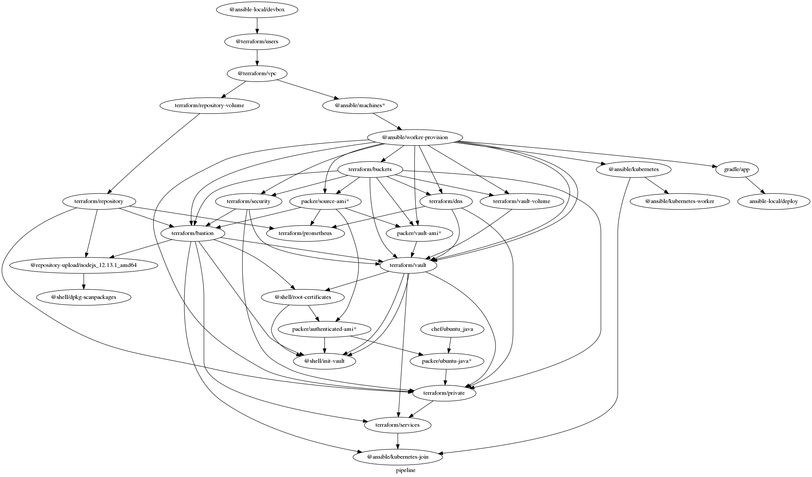
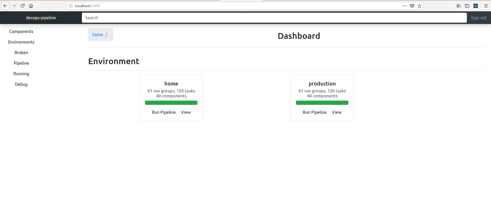
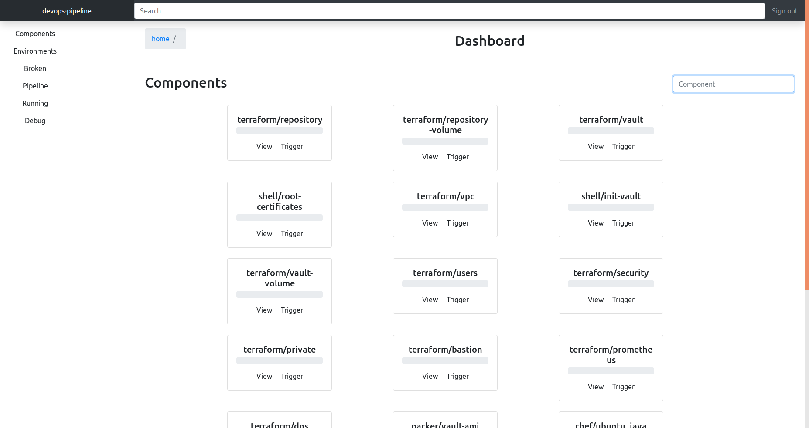
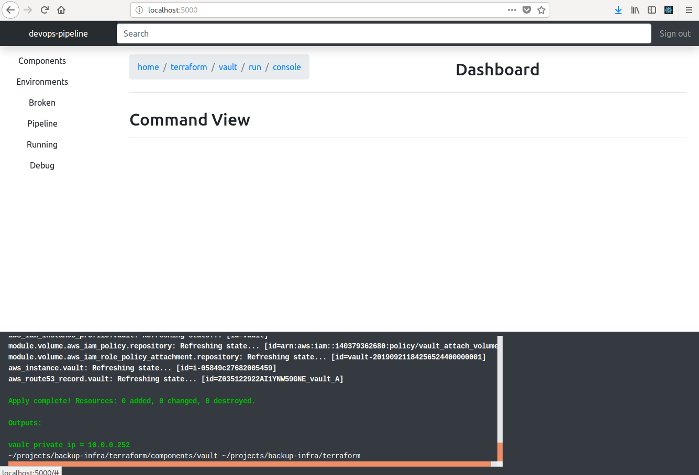
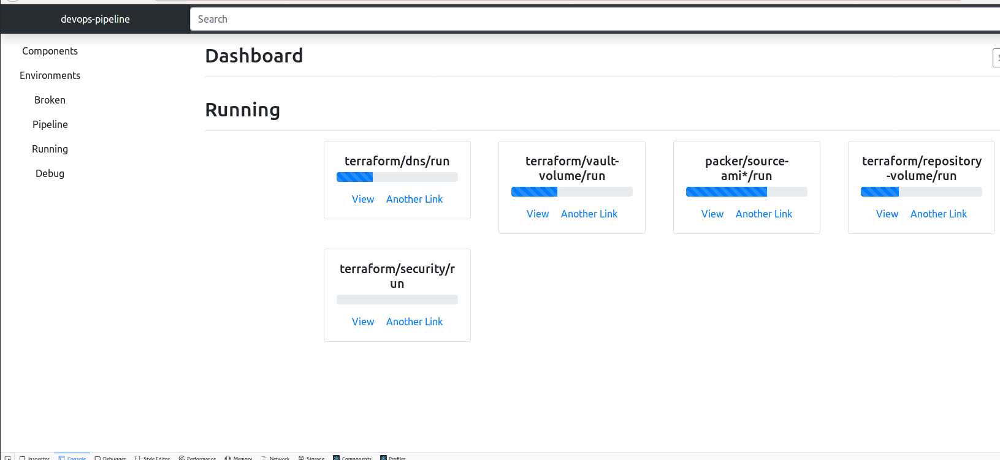

# devops-pipeline

**Prototype code** This is prototype code YMMV very much still in development

This build tool builds infrastructure for environments on the fly. It is meant to be a cross between a continuous integration server, build server and task runner. I call it a runserver. Its primary purpose is to try create complicated environments from scratch in a repeatable and deterministic way.

* This is the tool you run after making changes to your "as code" thing such as pipeline code, configuration management or Terraform
* It's what you run to begin tests.
* It's how you check to see if your changes have broken any thing anywhere on your stack.
* It runs against your entire stack by default.

## pipelines as code - configure your data flow with dot syntax

This tool executes a [dot syntax graph](https://en.wikipedia.org/wiki/DOT_(graph_description_language)) of an entire environment. The following graph:

 * provisions two CI workers with Ansible - future steps are executed on these workers
 * provisions 3 AMI builds  - base image, authenticated image and java image
 * Sets up Bastion servers with Terraform
 * Installs Prometheus and Grafana with Terraform
 * Sets up Hashicorp Vault with Terraform
 * Installs node_exporter on Vault, NAT instance and bastion.
 * Sets up a Certificate authority on a Hashicorp Vault server instance with shellscript
 * Initializes the Vault automatically and encrypts the Vault init secrets with GPG.
 * Creates an AMI with the certificate authority certificate pre-installed.



# traditional build ui for your software development lifecycle

It has a prototype web GUI to show status of builds of your infrastructure like a traditional build server.

Show your environments:



Show all your `components` separately:



Can look at the lifecycle of a component:


Show a `command` with log file output.



# performance optimisations

`devops-pipeline` is meant to be ran after each and every change to your infrastructure code. You should be able to change any two parts of your infrastructure - at any layer - and test those changes together. It is meant to be used to trigger unit testing of all parts of your pipeline impacted by your changes. If you make a change early in your pipeline, you should be able to trigger tests underneath that point onwards to see if you have broken any thing. devops-pipeline uses some performance optimizations to be cheap to run:

 * It calculates and runs in parallel what parts of your environment are safe to run at the same time where there are no data dependencies.
 * It detects if infrastructure directories has been changed and whether or not it needs to be reran.
 * It can run builds on SSH workers. You can use local builds to create and provision workers.

This is a screenshot showing the building of components that can run in parallel without impacting one another.



# Example - An AMI Pipeline

You want to use Chef to install Java and create an AWS AMI from that cookbook and then spin up an AWS instance that has Java pre-installed.


1. You have a Chef cookbook called ‘ubuntu-java’ that can install Java. You test with test kitchen.
2. You have a packer template file called ‘ubuntu-java.json’.
3. You have a terraform folder called ‘ubuntu-java’.


architecture.dot
```
digraph G {
  "chef/java" -> "packer/ubuntu-java" -> "terraform/ubuntu-java";
}
```

# Example - Using Ansible to provision Gradle apps in the cloud

The following is a pipeline of ansible, a gradle build, ansible to deploy and ansible to release the app.

```
digraph G {
  rankdir="LR";
  "ansible/machines" -> "gradle/app" -> "ansible/deploy" -> "ansible/release";
}
```
# Managing the lifecycle of volumes, AMIs and system packages

Resources such as volumes, system packages and AMIs change infrequently and remain for an extended period. We can mark these resources as manually triggered resources with a '*' symbol. While your infrastructure changes rapidly around them, these are updated less frequently.

The following pipeline is an example how to separate the lifecycle of things that change infrequently from things that change frequently. In this case, a volume for a server should be reran only when manually triggered.

```
digraph G {
 "terraform/repository-volume*" -> "terraform/repository";
}
```

Using fpm to package up nodejs, uploading it to a package repository and installing the package on VMs with ansible:

```
digraph G {
  "fpm/node" -> "shellscript/upload" -> "ansible/install"
}
```


# component based infrastructure

This tool sees infrastructure code in a certain way. Each run of a tool is a `component`. Components have names. Example components:

 * **ansible/provision-machines** could be a ansible role that runs configuration management
 * **packer/source-ami** could be a component that configures a base image for AWS
 * **packer/developer-box** could be a component that configures a base machine for developers
 * **shellscript/init-vault** could be shell scripts to glue together various things


# Introduction

devops-pipeline is a command line tool with a GUI to coordinate bringing up environments and running a chain of different devops tools.

* devops-pipeline coordinates other tools like Terraform, Ansible, Chef, shell scripts
* To configure, you write a `dot` file explaining the relationships and data flow between each tool.
* **Data is shared between tools as environment variables**
* You specify the order of what tools are needed to be used to bring up an entire environment. Each person on your team could have an entire environment for themselves without trampling on each other's changes.
* devops-pipeline runs all components with the same lifecycle of packaging, validation, running, testing
* Environment variables are how data is shared between tools.
* devops-pipeline is meant to be cheap to run; you run it after making a change. It works out what needs to rerun.

# Installation

See [devops-pipeline.com](http://devops-pipeline.com)

# Worker support

devops-pipeline can trigger builds on remote instances with SSH.

`--discover-workers-from-output` looks for a space separated output with this name and uses the hostnames or IP addresses to SSH onto and run builds.

```
python3 ~/projects/devops_pipeline/devops_pipeline/pipeline2.py home \
    --file architecture.dot \
    --gui \
    --discover-workers-from-output workers \
    --workers-key /home/sam/.ssh/vvv-sam-n550jv \
    --workers-user ubuntu

```

```
python3 ~/projects/devops_pipeline/devops_pipeline/pipeline.py \
  home \
  --file architecture.dot \
  --gui \
 --workers node1 node2 \
 --workers-key /home/sam/projects/backup-infra/.vagrant/machines/node1/virtualbox/private_key \
               /home/sam/projects/backup-infra/.vagrant/machines/node2/virtualbox/private_key \
 --workers-user vagrant

```


# command handlers

`devops-pipeline` runs commands against components in a predefined order. This is the lifecycle of commands for each component:

* **package** packaging happens first **on the master** to package code for workers
* **validate** runs syntax checkers
* **run** actually execute
* **test** test for correctness

To run a command, `devops-pipeline` runs a shellscript with the same name in the component directory. For example, `ansible/machines/run` will do this:

```
./run <environment> <component_name>
```

How command handlers handle component name is up to the command handler. In the fun-infra repository, this is what each handler does:

 * **packer** uses the component_name to be the name of the json template file
 * **ansible** uses the component_name to decide which playbook to run inside a playbooks folder (playbooks/<component_name>/<component_name>.yml)


# implementing commands such as run, test, validate

`run` is a script that executes the expected tool. There are a few things that the `run` script has to do.

* It has to write an exit code to a file. The path is in the `EXIT_CODE_PATH` environment variable
* It has to write `JSON` output to a file. The path is in the `OUTPUT_PATH` environment variable

Here is a minimum `run` for ansible:

```
#!/bin/bash

ENV=$1

if [ -z $ENV ] ; then
  echo "need to provide environment name"
  exit 1
fi
shift

COMPONENT=$1
echo $COMPONENT >&2

if [ -z $COMPONENT ] ; then
  echo "need to provide component name"
  exit 1
fi
shift

pushd playbooks/${COMPONENT}
set -a
source ~/.aws/env
set +a
ansible-playbook -i inventory ${COMPONENT}.playbook.yml
result=$?
echo ${result} > ${EXIT_CODE_PATH}
echo "{}" > ${OUTPUT_PATH}
```

# Dot configuration syntax

* Each node in your architecture graph should be named `provider/component` where `provider` is the directory code is kept and `component` which one to deploy (see sections of Component based architecture)
* Use directed edges in the order of creation.
* Prefixing components with an `@` (at symbol) causes them to run locally
* Suffixing with a `*` means that the component is only manually trigggered

# How to interpret the GUI and command line outputs

`terraform/webserver/run` is a reference to the `terraform` provider which is the directory of terraform code.  `webserver` is the component and `run` is a command. Commands are shell scripts in the provider directory so you can extend devops-pipeline with your own commands.

The word after the tool name is the component name.

You can provision your workers at the beginning of your pipeline by prefixing local components preceeded with an `@` (at symbol)

# Usage

To re-build everything in an environment, we run the following open localhost:5000 and click Environments an click Run Pipeline.
```
devops-pipeline environment --gui
```

# Todo

* Creating new environments from the UI
