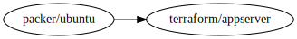
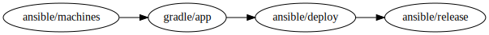
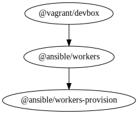

# introducing devops-pipeline

This is a prototype. YMMV

devops-pipeline is a tool to coordinate complicated environments that are built from multiple tools. devops-pipeline is kind of a task runner and it is modelled to appear like a continuous integration server.

## pipelines as code

Write self-descriptive pipelines in dot syntax that are renderable by graphviz and executable by this tool. devops-pipeline uses Graphviz dot file syntax for its configuration and we model data flow through pipelines.

### Example - building an AMI


file: architecture.dot
```
digraph G {
   rankdir="LR";
   "packer/ubuntu" -> "terraform/appserver";
}
```
`packer/ubuntu` is a component that that creates machine images on AWS with Java installed and outputs an AMI identifier of the created AMI.
`terraform/appserver` is a component that uses that AMI id it received by environment variable to bring up a new instance running that AMI

## Example - building a Java app

file: architecture.dot
```
digraph G {
  rankdir="LR";
  "ansible/machines" -> "gradle/app" -> "ansible/deploy" -> "ansible/release";
}
```
`ansible/machines` is a component that provisions machines running java.
`gradle/app` is a component that builds from source a Java app.

# introduction

`devops-pipeline` is for deterministically creating computer environments. An example environment is one that uses AWS, Terraform, Packer, shell scripts, Ansible, docker, Chef. `devops-pipeline` allows you to chain together tools for running on your developer workstation. devops-pipeline models the flow of data between tools and uses environment variables to pass along data. devops-pipeline is meant to be used after each change whereby it runs validations, unit tests, smoke tests and deployments tests.

# quickstart

TODO

# parallel execution

`devops-pipeline` knows what parts of your environment infrastructure can run together in concurrently and in parallel due to the graphs defining data flow.


# SSH workers

You don't always want to run builds on the master node (where you run devops-pipeline from) You can specify a list of hosts to run builds on remote servers.

```
devops-pipeline --file architecture.dot \
    --gui \
    --workers node1 node2 \
    --workers-key ~/.ssh/worker-ssh-key \
    --workers-user ubuntu
```

## idiom - provision workers at the beginning of your pipeline

An idiom in `devops-pipeline` is that your early stages in your pipeline is provisioning worker nodes. These worker nodes run the remainder of the build. You can replace `--workers` with `--discover-workers-from-output <output name>` where `output name` is the name of an ouput from your machine provisioning component that contains a list of server hostnames or IP addresses that you can SSH onto.

Here is an example of ansible provisioning EC2 instances and installing dependencies on worker nodes, then running packer to build an AMI and launching that AMI with terraform.


The at symbol `@` at the beginning of a component reference means that this component builds on the master node.

```
digraph G {
	rankdir="LR";
	"@ansible/machines" -> "@ansible/provision-workers"-> "packer/source-ami" -> "terraform/appservers";
}
```

## idiom - building development workstations



```
digraph G {
	"@vagrant/devbox" -> "@ansible/workers" -> "@ansible/workers-provision";
}
```

# Quickstart


# why devops-pipeline

* Environments are complicated
* Knowledge of how bring up a new environment is not machine readable
* You want to make a change to a complicated system that will affect every thing, you need a repeatable way to test.
